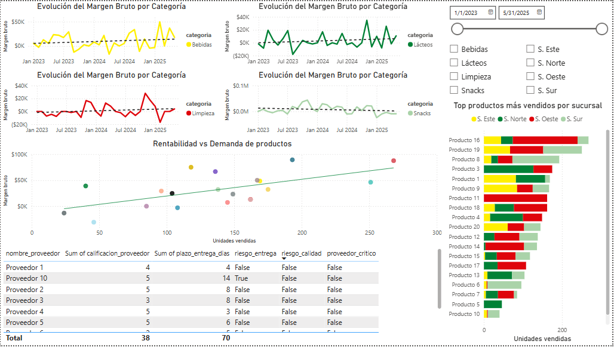

# Análisis de Demanda y Compras – Mercaldas

Proyecto: Prueba Técnica Avanzada para Analista de Planeación de la Demanda en Mercaldas.  
Objetivo: Demostrar competencias en integración de datos, análisis estratégico, visualización, modelado predictivo y propuesta de estrategia de negociación con proveedores.

---

## 1. Estructura del Repositorio

A continuación se describe la estructura final del repositorio:

```

project-root/
├── .gitignore
├── README.md
├── requirements.txt
├── dashboard/
│   └── mercaldas\_analytics.pbix
├── data/
│   ├── raw/
│   │   ├── base_datos_colombia.xlsx
│   │   └── Prueba_Tecnica_Ciencia_Datos_Mercaldas.docx
│   └── processed/
│       ├── tabla_consolidada.csv
│       ├── top10_rotacion.csv
│       └── proveedores_riesgo.csv
├── notebooks/
│   ├── 01_etl.ipynb
│   ├── 02_analisis_modelo.ipynb
│   └── 03_modelo_predictivo.ipynb
├── output/
│   └── dashboard.png
├── utils/
│   └── data_loader.py
├── models/
│   ├── model_tree.pkl
│   ├── model_rf.pkl
│   └── model_xgb.pkl
└── README.md

````

- **.gitignore**: Ignora datos crudos pesados y archivos temporales de notebooks.  
- **requirements.txt**: Lista de librerías con versiones reproducibles.  
- **dashboard/**: Archivo Power BI (.pbix)  
- **data/raw/**: Datos originales inmutables (Excel, documentos de enunciado). No modificables; no subir versiones grandes al control de versiones.  
- **data/processed/**: Resultados de ETL que sirven como insumo único para análisis y dashboard. Generados automáticamente desde notebooks.  
- **notebooks/**:  
  - `01_etl.ipynb`: ETL y creación de `tabla_consolidada.csv`.  
  - `02_analisis_modelo.ipynb`: Análisis exploratorio, métricas estratégicas y comparativa de proveedores.  
  - `03_modelo_predictivo.ipynb`: Construcción de tabla semanal, features, entrenamiento y comparación de modelos.  
- **output/**: Gráficos exportados y screenshots.  
- **utils/data_loader.py**: Funciones reutilizables para carga y validación de datos.  
- **models/**: Modelos ya entrenados guardados con joblib (`.pkl`).  
  - `model_tree.pkl`  
  - `model_rf.pkl`  
  - `model_xgb.pkl`  
- **README.md**: Documentación general (este archivo).

---

## 2. Requisitos e Instalación

1. Python 3.11 (o superior).  
2. Crear entorno virtual (recomendado).  
3. Instalar dependencias:

   ```bash
   pip install -r requirements.txt
    ```

Contenido mínimo típico de `requirements.txt`:

```
pandas
numpy
matplotlib
seaborn
scikit-learn
xgboost
openpyxl
joblib
```
4. Asegurarse de contar con Power BI Desktop (para abrir `dashboard/mercaldas_analytics.pbix`) o alternativamente usar otra herramienta si se reimplementa.

---

## 3. Flujo de Trabajo

A continuación se resume el proceso end-to-end, con justificaciones y decisiones clave según la prueba.

### 3.1 ETL y Preparación de Datos (notebook `01_etl.ipynb`)

* **Lectura de datos crudos** desde `data/raw/base_datos_colombia.xlsx` (hojas: compras, ventas, productos, proveedores, promociones).
* **Typecasting cuidadoso**: convertir columnas a tipos adecuados (`datetime64`, `category`, numéricos).
* **Construcción de tabla consolidada** a nivel diario (`fecha`, `sucursal`, `producto_id`):

  * Generar MultiIndex de fechas × sucursales × productos (rango completo).
  * Agregar sumas/medias de ventas y compras por día.
  * Merge con tablas de productos, proveedores y promos.
  * Cálculo de columnas derivadas:

    * `margen_bruto = precio_venta - costo_unitario`.
    * `producto_en_promocion` (flag).
  * **Exportar** la tabla resultante como CSV en `data/processed/tabla_consolidada.csv`.
* **Decisión de exclusión de métricas poco fiables**:

  > *Días de Inventario Estimado* descartado por baja densidad de datos (pocas compras/ventas en largo periodo). Esto evita métricas sin respaldo estadístico ni operacional.

### 3.2 Análisis Estratégico (notebook `02_analisis_modelo.ipynb`)

* **Carga** de `tabla_consolidada.csv` con `parse_dates=['fecha']`.
* **Top 10 productos de mayor rotación por sucursal** (último semestre):

  * Filtrado dinámico del período.
  * Agrupación y selección de top 10.
  * Exportación opcional a `data/processed/top10_rotacion.csv` para uso en Power BI / reporte.
* **Análisis de proveedores**:

  * Carga de tabla `df_proveedores` (desde CSV o inline).
  * Métricas de plazo de entrega y calificación usando métodos estadísticos:

    * **Z-score** y **IQR** para detectar outliers negativos.
    * Generación de `proveedores_riesgo.csv` en `data/processed/`.
  * Interpretación: identificación de proveedores con plazos inusuales o baja calificación relativa.
* **Decisión de exclusión**:

  > Rupturas de inventario descartadas dadas la escasa representatividad de datos. Incluirlas introduciría ruido y falsos positivos.

* **Exportación** de resultados parciales en CSV

### 3.3 Dashboard Interactivo – Power BI (`dashboard/mercaldas_analytics.pbix`)

* **Fuente principal**: `data/processed/tabla_consolidada.csv`.
* **Componentes**:

  1. Evolución de margen bruto por categoría: cuatro líneas separadas (una por categoría) con línea de tendencia.
  2. Scatterplot margen bruto vs unidades vendidas.
  3. Top productos más vendidos por sucursal (barras horizontales apiladas).
  4. Tabla de proveedores (sin columnas técnicas) para monitoreo rápido.
  5. Slicers: categoría, sucursal y rango de fechas.
* **Exportación**: Screenshot en `output/dashboard.png` para documentación estática.


### 3.4 Modelado Predictivo de Demanda Semanal (notebook `03_modelo_predictivo.ipynb`)

* **Construcción de tabla semanal**:

  * Identificar top 5 productos de mayor venta total (dinámicamente, agrupando sobre `tabla_consolidada.csv`).
  * Transformación diaria → semanal con `assign(semana=...)` en el flujo de groupby.
  * Variables base: `unidades_vendidas`, `precio_promedio`, `en_promocion`.
* **Feature Engineering**:

  * `ventas_semana_anterior`, `promedio_ultimas_4_semanas`, calculados con `groupby.shift()` y rolling.
  * `precio_vs_medio_producto`.
  * Variables de calendario: `semana_del_año`, `mes`.
  * Limpieza: eliminar filas con NaNs en features esenciales.
* **División temporal**:

  * `fecha_split = df_modelo['semana'].sort_values().quantile(0.6)` → entrenamiento (datos más antiguos) vs prueba (20–40% más recientes).
  * Justificación: poca data disponible, se prefiere mayor proporción de entrenamiento.
* **Entrenamiento de modelos**:

  1. **Árbol de Decisión** (`DecisionTreeRegressor`), nombrado `tree_model`.
  2. **Random Forest** (`RandomForestRegressor`), nombrado `rf_model`.
  3. **XGBoost** (`XGBRegressor`), nombrado `xgb_model`.
* **Evaluación homogénea** (MAE, RMSE, scatter pred vs real), usando el mismo formato de impresión y gráfica para cada modelo.
* **Resultados obtenidos**:

  * Árbol: MAE \~15.33, RMSE \~20.17.
  * Random Forest: MAE \~14.67, RMSE \~17.19.
  * XGBoost: MAE \~16.78, RMSE \~20.19.
* **Feature importance**: todos mostraron dependencia de estacionalidad y precio, ignorando ventas históricas y promociones, reflejo de datos limitados.
* **Limitación crítica**:

  > Debido al reducido tamaño del conjunto de entrenamiento (solo \~18 semanas de datos para top productos), cualquier modelo predictivo resultante carece de confiabilidad para decisiones operativas.
* **Guardado de modelos**:

  * Usar joblib para serializar:

    ```python
    import joblib
    joblib.dump(tree_model, '../models/model_tree.pkl')
    joblib.dump(rf_model,   '../models/model_rf.pkl')
    joblib.dump(xgb_model,  '../models/model_xgb.pkl')
    ```
  * Notar en el README que estos modelos pueden reutilizarse en validaciones posteriores o en prototipos, pero no se recomiendan para producción hasta contar con más datos.

### 3.5 Comparativa de Modelos

Se presenta tabla comparativa en Markdown:

| Modelo            | MAE   | RMSE  | Variables principales                               |
| ----------------- | ----- | ----- | --------------------------------------------------- |
| Árbol de Decisión | 15.33 | 20.17 | `precio_vs_medio_producto`, `semana_del_año`, `mes` |
| Random Forest     | 14.67 | 17.19 | `precio_vs_medio_producto`, `semana_del_año`, `mes` |
| XGBoost           | 16.78 | 20.19 | `semana_del_año`, `precio_vs_medio_producto`, `mes` |

* Interpretación: Random Forest ligeramente mejor, pero todos los modelos limitados por escasez de datos.
* Recomendación técnica: no aplicar estos modelos en producción. Foco en recopilar más datos y mejorar features antes de confiar en predicciones.

---

## 4. Limitaciones y Recomendaciones Generales

* **Limitación de datos**: La cantidad y granularidad de ventas (pocas transacciones en un periodo extenso) impide construir modelos de demanda robustos.
* **Variables externas faltantes**: Días festivos, eventos locales, campañas, clima, etc., no están integrados.
* **Registro de promociones y comportamiento**: Es necesario un sistema de tracking que capture fechas exactas de promociones, segmentación de canales, etc.
* **Calidad de datos de inventario**: Sin stock real diario ni flujos de entradas/salidas, no se puede estimar inventario ni rupturas con confianza.

**Recomendaciones**:

* Establecer pipeline de recolección continua de datos de ventas e inventario a nivel diario/semanal.
* Registrar eventos externos y campañas en una tabla auxiliar.
* Implementar seguimiento de pedidos (fecha de orden, fecha real de entrega, cantidades recibidas) para medir desempeño de proveedores.
* Aumentar muestra de datos: al menos 1 año de histórico semanal por producto-sucursal para modelado.
* Planificar almacenamiento y versionado de datos en un data warehouse o base SQL si escala el volumen.
* Integrar alertas (dashboard) para indicadores clave: rotación, márgenes, variabilidad de precios y lead times de proveedores.

---

## 5. Caso Final (Bonus): Estrategia de Negociación con Proveedores

> *Enunciado:*
> Suponga que Mercaldas quiere renegociar con proveedores. Elija una categoría crítica (por ejemplo, “lácteos”) y proponga una estrategia basada en datos para:
>
> * Mejorar márgenes
> * Minimizar quiebres de inventario
> * Priorizar proveedores estratégicos

### Elección de Categoría Crítica

La categoría **Lácteos** fue seleccionada como caso de estudio debido a su alta rotación en ventas (según análisis ficticio realizado para esta prueba, con base en la categoría `Lácteos`), naturaleza perecedera y sensibilidad a interrupciones de stock. Esta elección no es arbitraria: parte del análisis previo de la tabla consolidada, donde dicha categoría demostró un comportamiento dinámico que la convierte en una pieza clave para las operaciones logísticas y de compras.

### Análisis Diagnóstico

Se propone un enfoque basado en la extracción de una subtabla filtrada por esta categoría. A partir de ella, se deben calcular:

* **Volumen promedio semanal** por producto y sucursal
* **Margen bruto promedio** y su volatilidad
* **Variabilidad de la demanda**, usando desviaciones estándar o coeficientes de variación

Esto permite identificar productos lácteos de alta rotación pero bajo margen, que son candidatos ideales para renegociaciones de precio. Además, se debe analizar el comportamiento de las promociones en esta categoría, ya que campañas mal planificadas podrían afectar negativamente los márgenes. Detectar patrones en los ciclos promocionales también abriría la posibilidad de coordinar descuentos por volumen en épocas de baja demanda.

A nivel de proveedores, el análisis debe centrarse en los asociados a productos lácteos, evaluando:

* Plazo medio de entrega y su consistencia
* Estabilidad de precios a través del coeficiente de variación
* Calificaciones internas o desempeño histórico (cuando estén disponibles)

Estos datos permitirán clasificar a los proveedores según su nivel de riesgo o confiabilidad.

### Propuesta Estratégica

**1. Para mejorar márgenes:**

* Negociar precios de compra basados en volumen histórico y, a futuro, en pronósticos de demanda más precisos.
* Solicitar condiciones preferenciales a cambio de compromisos de compra (e.g., descuentos por volumen o extensiones en plazos de pago).
* Optimizar el mix de productos: priorizar los de alta rotación y buen margen, y evaluar el retiro de aquellos con baja rentabilidad.

**2. Para minimizar quiebres de inventario:**

* A futuro, aplicar modelos de predicción más robustos para definir puntos de reorden y niveles de seguridad.
* Establecer acuerdos con proveedores para entregas urgentes en caso de riesgo de ruptura.
* Visualizar indicadores críticos en dashboards, como el stock proyectado según ventas recientes y lead time.

**3. Para priorizar proveedores estratégicos:**

* Desarrollar un índice compuesto que combine métricas como plazo de entrega, variabilidad de precio, calidad y confiabilidad logística.
* Generar un ranking dinámico de proveedores que sirva de base para asignar volúmenes y definir relaciones a largo plazo.
* Aplicar estrategias de diversificación: al menos dos proveedores por subproducto clave para evitar dependencia crítica.

### Implementación y Seguimiento

Antes de aplicar la estrategia, es fundamental garantizar la **calidad de los datos**: validar registros históricos de ventas, entregas y stock. Luego, se recomienda crear un **dashboard específico para Lácteos**, con visualizaciones de rotación, márgenes y desempeño de proveedores.

Se puede iniciar un **piloto de renegociación** con 2 o 3 proveedores clave, presentando análisis de rotación y requerimientos de volumen. Este piloto debe estar respaldado por un sistema de **monitoreo continuo**, con revisiones trimestrales que retroalimenten la estrategia y permitan refinar acuerdos, niveles de stock y decisiones de portafolio.

---

## 6. Notas Técnicas y Buenas Prácticas

* **Control de versiones**:

  * No versionar datos grandes crudos. Versionar notebooks, scripts y definiciones de pipeline.
  * TO DO: Incluir un `README` en `data/` que indique qué archivos se generan y no deben editarse manualmente.
* **Modularidad**:

  * Funciones reutilizables en `utils/data_loader.py` y otros módulos si se expande el proyecto.
* **Entorno reproducible**:

  * `requirements.txt` con versiones fijas.
  * Instrucciones claras para reinstalar ambiente.
* **Serialización de modelos**:

  * Guardar con joblib en `models/`.
  * TO DO: Registrar metadatos básicos (fecha de entrenamiento, métricas obtenidas) en un pequeño JSON o CSV de auditoría si se desea trazabilidad.
* **Documentación en notebooks**:

  * Celdas con comentarios explicativos y justificaciones de decisiones (por qué se descartó análisis de inventario, etc.).
* **Gestión de secretos**:

  * TO DO: Si surge la necesidad de credenciales (base de datos remota, API de clima, etc.), usar variables de entorno y no hardcodear en scripts.
* **Automatización futura**:

  * Pensar en scripts o Airflow/Luigi para ETL automático, si se escala a procesos regulares.
  * Integrar con base de datos SQL o data warehouse para almacenamiento centralizado.

---

## 7. Autor

**Pablo Alejandro López Sánchez**  
Data Analyst – Business Analyst  
Fecha: 19 de junio del 2025  
[poglolopez@gmail.com](mailto:poglolopez@gmail.com)  
[LinkedIn](https://www.linkedin.com/in/pablo-a-lopez-s/)  
[GitHub](https://github.com/PogloLopez)
